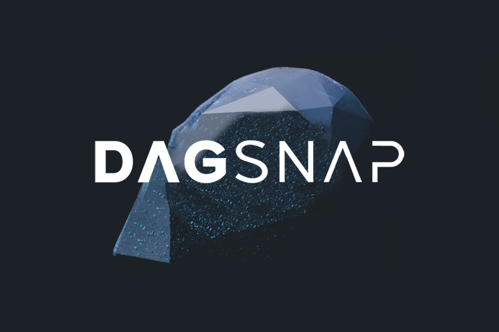

# DAGSNAP

## 🚀 Quick Start

**GitHub Repo**: [dagsnap](https://github.com/satyasandeep007/dagsnap)  
**Demo Video**: [Watch on YouTube](https://www.youtube.com)



## 🌟 Inspiration

MetaMask's limited blockchain support inspired us to integrate DAG functionality using MetaMask Snaps, expanding crypto accessibility 🚀.

## 🔧 What it does

**DagSnap** enables users to:

- 🪙 Create a DAG wallet
- 💳 Buy, send, and manage DAG tokens
- 📲 Directly interact with DAG through MetaMask

## 🛠️ How we built it

We developed a custom MetaMask Snap and integrated DAG chain into it by using `dag4.js`. We built everything from scratch, as there were no existing Next.js + Snap templates available, so we developed our own template 💡.

## 🛠️ Tech Stack

- DAG4.js
- Constellation Chain
- MetaMask Snap
- Next.js
- TailwindCSS
- Express Js
- Typescript

## 📚 Installation & Setup

1. **Clone the repository**

   ```bash
   git clone https://github.com/satyasandeep007/dagsnap
   cd dagsnap
   ```

2. **Install All Dependencies**

   Run the following command to install dependencies for the frontend, proxy server, and Snap:

   ```bash
   yarn run install-all
   ```

3. **Run the Application**

   You can start all services (Frontend, Proxy Server, and Snap) with the following command:

   ```bash
   yarn watch
   ```

## 🚀 Running the App

This will run:

- Frontend: http://localhost:3000
- Snap: http://localhost:8080
- Proxy Server: http://localhost:9090

## 👥 Meet the Team

<table>
  <tr>
    <td align="center">
      <a href="https://github.com/shivamangina">
        <br />
        <sub><b>Shiva Kumar</b></sub>
      </a><br />
      <a href="https://www.linkedin.com/in/shivamangina/" title="LinkedIn">💼</a>
      <a href="https://twitter.com/shivakmangina" title="Twitter">🐦</a>
    </td>
    <td align="center">
      <a href="https://github.com/satyasandeep007">
        <br />
        <sub><b>Sandeep Kumar</b></sub>
      </a><br />
      <a href="https://www.linkedin.com/in/satyasandeep" title="LinkedIn">💼</a>
      <a href="https://twitter.com/satyasandeep76" title="Twitter">🐦</a>
    </td>
    <td align="center">
      <a href="https://github.com/vinay4656">
        <br />
        <sub><b>Vinay Godawarthi</b></sub>
      </a><br />
      <a href="https://www.linkedin.com/in/vinaygodawarthi/" title="LinkedIn">💼</a>
      <a href="https://twitter.com/vinaygodawarthi" title="Twitter">🐦</a>
    </td>
  </tr>
</table>
